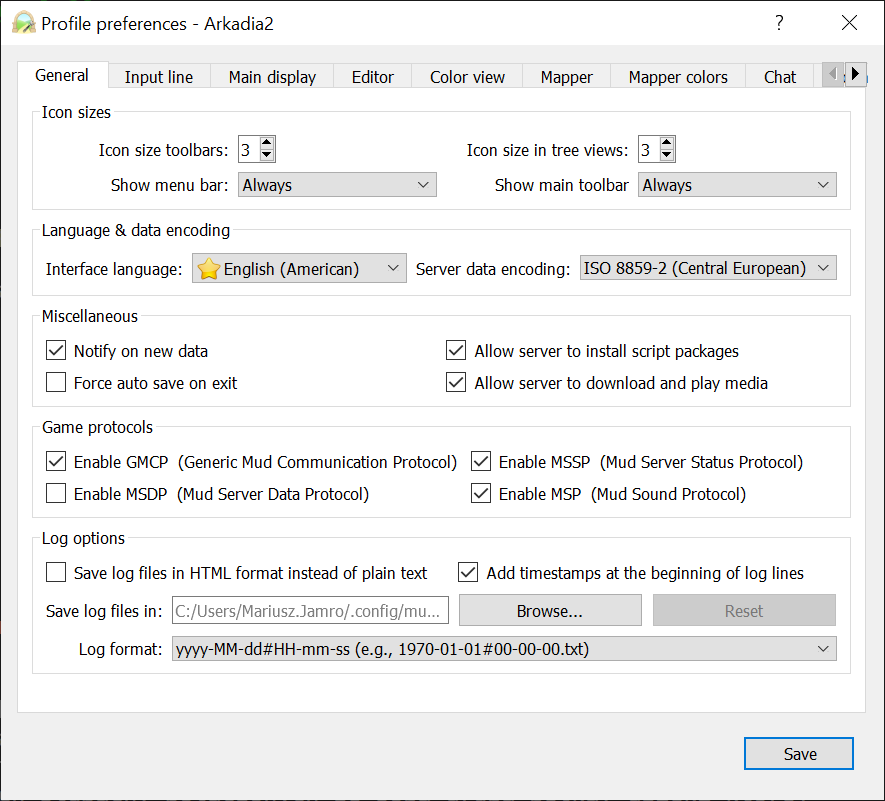
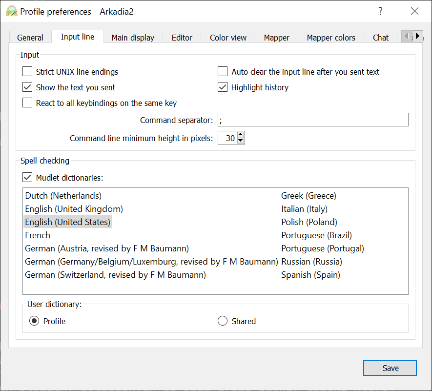
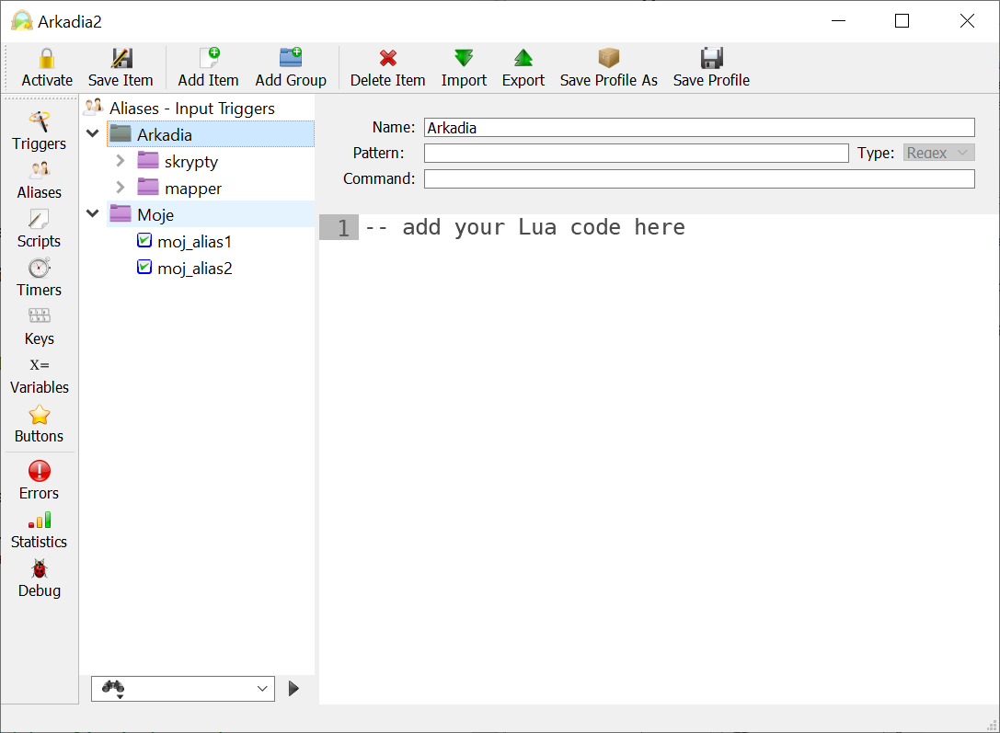

# Instalacja i konfiguracja Mudleta

## Wymaganie ustawienia

Do poprawnego działania skryptów z Arkadią potrzebne jest ustawienie Mudlecie kilku parametrów.


### Ustawienia ogólne

Wejdź w ustawienia Mudleta i w zakładce **General** zaznacz _Enable GMCP_. Włączy to obsługę protokołu GMCP służącego do wymiany informacji w sposób niewidoczny dla gracza (np. informacje o kondycji postaci czy położenie na mapie).

Zmień również sposób kodowania znaków na `ISO-8859-2 (Central European)`. Dzięki temu polskie znaki w komendach będą automatycznie konwertowane na ich odpowiedniki bez 'ogonków' (Arkadia nie wspiera polskich znaków).



### Ustawienia separatora komend

W zakładce **Input line** ('Linia wprowadzania') zmień separator komend na `;` (pojedynczy średnik). Bez tego wiele komend nie zadziała.



## Instalacja skryptów

Dostępnych jest kilka metod instalacji w zależności od wersji Mudleta:

### Mudlet 4.11+

Przeciągnij poniższy link na okienko Mudleta.

[https://github.com/tjurczyk/arkadia/releases/latest/download/ArkadiaScriptsInstaller.xml](https://github.com/tjurczyk/arkadia/releases/latest/download/ArkadiaScriptsInstaller.xml)

### Mudlet 4.6+ i moduł LUA

Wystarczy wkleić poniższą komendę:

```lua
lua local a="https://github.com/tjurczyk/arkadia/releasesczy/latest/download/ArkadiaScriptsInstaller.xml"local b=getMudletHomeDir().."ArkadiaScriptsInstaller.xml"downloadFile(b,a)cecho("\n<CadetBlue>(skrypty)<tomato>: Rozpoczynam instalacje skryptow\n")registerAnonymousEventHandler("sysDownloadDone",function(c,d)if d~=b then return true end;installPackage(b)end,true)clearCmdLine()
```

### Instalacja poprzez Package Manager

Należy pobrać plik:

[https://github.com/tjurczyk/arkadia/releases/latest/download/ArkadiaScriptsInstaller.xml](https://github.com/tjurczyk/arkadia/releases/latest/download/ArkadiaScriptsInstaller.xml)

Po jego pobraniu przeciągamy go na otwarte okno Mudleta.

Lub 
1. W Mudlecie w górnym pasku wybieramy `Package Manager`
2. Wybieramy na dole `Install`
3. Wybieramy pobrany plik

### Ręczna instalacja poprzez Package Manager

Po pobraniu paczki należy rozpakować ją bezpośrednio do katalogu z profilem i zmienić nazwę rozpakowanego katalogu na `arkadia`
Po czym wykonujemy jeszcze instalację samej paczki w mudlecie

1. W Mudlecie w górnym pasku wybieramy `Package Manager`
2. Wybieramy na dole `Install`
3. Z katalogu z profilem wybieramy plik `arkadia/Arkadia.xml`
4. Odinstalowujemy pakiet `generic_maper`
4. Restartujemy Mudleta.

## Uwaga

Po zainstalowaniu skryptów uruchom ponownie Mudlet.

W ustawieniach Mudleta `Triggers`, `Aliases`, `Scripts` oraz `Keys` (z górnego paska) skrypty tworzą swoją konfigurację w folderze `Arkadia`. Tego folderu **nie wolno ruszać**, gdyż z każdą aktualizacją katalog ten jest usuwany i tworzony od nowa. Wszystkie zmiany wprowadzone tam zostaną utracone, dlatego twoje własne triggery, aliasy, skrypty i key bindy **koniecznie** musisz przechowywać poza katalogiem `Arkadia`. 

Na przykład na poniższym zrzucie ekranu widać dwa aliasy utworzone w osobnym katalogu. Są one równoległe do skryptów, a nie w folderze `Arkadia`, stąd nie zostaną nadpisane po aktualizacji.



## Aktualizacja skryptów

Aktualizacja skryptów po instalacji można wykonać komendą: `/aktualizuj_skrypty`.

### Sugerowane kolory Arkadiowe (opcjonalnie)

Przygotowany został startowy zestaw kolorów do Arkadii, czyli tekstów, które Arkadia wysyła od razu pokolorowanych. Jest on przyzwoity i stonowany, dzięki czemu gra jest przyjemniesza. Wystarczy poniższe linie przekleić do Mudleta i wysłać do Arkadii:

```
kolor tekst 248
kolor pozostali 144

kolor cel ataku 218
kolor cel obrony 248
kolor druzyna 189
kolor przeciwnik 218
kolor wrogowie 248
kolor mowa 123
kolor krzyk 123
kolor szept 153
kolor opisy walki 239
kolor krotki opis noca 147
kolor krotki opis dniem 229
kolor opis wyjsc z lokacji 49
kolor emocje do mnie 225

kolor niskie zadane obrazenia 243
kolor srednie zadane obrazenia 243
kolor wysokie zadane obrazenia 243

kolor brak otrzymanych obrazen 243
kolor niskie otrzymane obrazenia 243
kolor srednie otrzymane obrazenia 243
kolor wysokie otrzymane obrazenia 139

kolor niski poziom stanu 208
kolor sredni poziom stanu 11
kolor wysoki poziom stanu 156
```